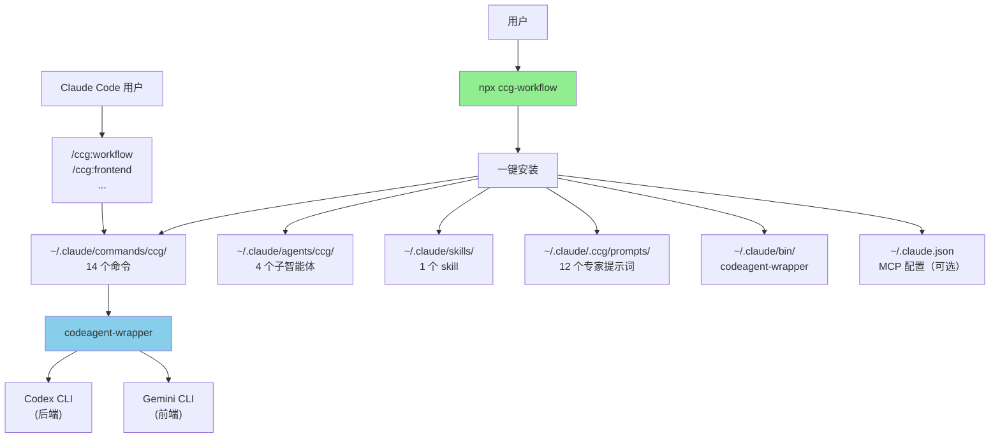

# skills-v2 (CCG Multi-Model Collaboration System)

> [根目录](../CLAUDE.md) > **skills-v2**

**Last Updated**: 2026-01-08 (v1.7.0)

---

## 变更记录 (Changelog)

### 2026-01-08 (v1.7.0)
- 🎯 **大幅简化安装流程**：只需配置 MCP（可选），无需选择语言/模型/命令
- 🔧 **固定模型路由**：Gemini (前端) + Codex (后端)，不再支持自定义
- ✂️ **精简命令**：从 17 个减少到 14 个
  - 删除 `think`（与 analyze 重叠）
  - 删除 `bugfix`（与 debug 重叠）
  - 删除 `code`（被 workflow 覆盖）
  - 删除 `enhance`（集成到 workflow）
- 📝 **重写所有命令模板**：统一 `[模式：X]` 标签系统，精简到 100-140 行

### 2026-01-07 22:25:00 (v1.6.1)
- ✨ **新增平台支持**：Linux ARM64 + Windows ARM64
- 🔧 编译 `codeagent-wrapper-linux-arm64` (2.7MB)
- 🔧 编译 `codeagent-wrapper-windows-arm64.exe` (2.7MB)
- 📝 修改 `installer.ts` 支持全平台架构检测 (darwin/linux/windows × amd64/arm64)
- 🎯 **覆盖率**: 100% 主流平台（6 个二进制文件）

---

## 模块职责

**CCG (Claude + Codex + Gemini)** - 多模型协作系统的核心实现，提供：

1. **多模型协作编排**：固定路由 Gemini（前端）+ Codex（后端）+ Claude（编排）
2. **14 个斜杠命令**：开发工作流 + Git 工具 + 项目管理
3. **12 个专家提示词**：Codex 6 个 + Gemini 6 个
4. **跨平台 CLI 工具**：一键安装（支持 macOS、Linux、Windows）
5. **MCP 集成**：ace-tool 可选配置（代码检索 + Prompt 增强）

---

## 入口与启动

### 用户安装入口

```bash
# 一键安装（推荐）
npx ccg-workflow

# 交互式菜单
npx ccg-workflow menu
```

### CLI 入口点

- **主入口**：`bin/ccg.mjs` → `src/cli.ts`
- **核心命令**：
  - `init` - 初始化工作流（`src/commands/init.ts`）
  - `update` - 更新工作流（`src/commands/update.ts`）
  - `menu` - 交互式菜单（`src/commands/menu.ts`）
  - `diagnose-mcp` - MCP 诊断（`src/commands/diagnose-mcp.ts`）
  - `config` - 配置管理（`src/commands/config-mcp.ts`）

### codeagent-wrapper 入口

- **主入口**：`codeagent-wrapper/main.go`
- **调用语法**：
  ```bash
  codeagent-wrapper --backend <codex|gemini|claude> - [工作目录] <<'EOF'
  <任务内容>
  EOF
  ```

---

## 对外接口

### CLI 命令接口

| 命令 | 用途 |
|------|------|
| `npx ccg-workflow` | 一键安装/菜单 |
| `npx ccg-workflow menu` | 交互式菜单 |
| `npx ccg-workflow update` | 更新到最新版本 |
| `npx ccg-workflow diagnose-mcp` | 诊断 MCP 配置 |

### Slash Commands 接口（14 个）

**开发工作流**：
| 命令 | 用途 | 模型 |
|------|------|------|
| `/ccg:workflow` | 完整 6 阶段工作流 | Codex ∥ Gemini |
| `/ccg:frontend` | 前端专项（快速模式） | Gemini |
| `/ccg:backend` | 后端专项（快速模式） | Codex |
| `/ccg:feat` | 智能功能开发 | 规划 → 实施 |
| `/ccg:analyze` | 技术分析（仅分析） | Codex ∥ Gemini |
| `/ccg:debug` | 问题诊断 + 修复 | Codex ∥ Gemini |
| `/ccg:optimize` | 性能优化 | Codex ∥ Gemini |
| `/ccg:test` | 测试生成 | 智能路由 |
| `/ccg:review` | 代码审查（自动 git diff） | Codex ∥ Gemini |

**项目管理**：
| 命令 | 用途 |
|------|------|
| `/ccg:init` | 初始化项目 CLAUDE.md |

**Git 工具**：
| 命令 | 用途 |
|------|------|
| `/ccg:commit` | 智能提交（conventional commit） |
| `/ccg:rollback` | 交互式回滚 |
| `/ccg:clean-branches` | 清理已合并分支 |
| `/ccg:worktree` | Worktree 管理 |

---

## 固定配置

v1.7.0 起，以下配置不再支持自定义：

| 项目 | 固定值 | 原因 |
|------|--------|------|
| 语言 | 中文 | 所有模板为中文 |
| 前端模型 | Gemini | 擅长 UI/CSS/组件 |
| 后端模型 | Codex | 擅长逻辑/算法/调试 |
| 协作模式 | smart | 最佳实践 |
| 命令数量 | 14 个 | 全部安装 |

---

## 关键依赖与配置

### TypeScript 依赖

**运行时依赖**：
- `cac@^6.7.14` - CLI 框架
- `inquirer@^12.9.6` - 交互式提示
- `ora@^9.0.0` - 加载动画
- `ansis@^4.1.0` - 终端颜色
- `fs-extra@^11.3.2` - 文件系统工具
- `smol-toml@^1.4.2` - TOML 解析

**开发依赖**：
- `typescript@^5.9.2`
- `unbuild@^3.6.1` - 构建工具
- `tsx@^4.20.5` - TypeScript 执行器

### Go 依赖

- Go 标准库（无外部第三方依赖）

### 配置文件

**用户配置**：
- `~/.claude/.ccg/config.toml` - CCG 主配置

**MCP 配置**：
- `~/.claude.json` - Claude Code MCP 服务配置

---

## 相关文件清单

### 核心源码

```
src/
├── cli.ts                     # CLI 入口
├── cli-setup.ts               # 命令注册
├── commands/
│   ├── init.ts                # 初始化命令
│   ├── update.ts              # 更新命令
│   ├── menu.ts                # 交互式菜单
│   └── ...
├── utils/
│   ├── installer.ts           # 安装逻辑（核心）
│   ├── config.ts              # 配置管理
│   ├── mcp.ts                 # MCP 工具集成
│   └── ...
```

### 模板文件

```
templates/
├── commands/                  # 14 个斜杠命令
│   ├── workflow.md
│   ├── frontend.md
│   ├── backend.md
│   ├── feat.md
│   ├── analyze.md
│   ├── debug.md
│   ├── optimize.md
│   ├── test.md
│   ├── review.md
│   ├── init.md
│   ├── commit.md
│   ├── rollback.md
│   ├── clean-branches.md
│   ├── worktree.md
│   └── agents/               # 4 个子智能体
│       ├── planner.md
│       ├── ui-ux-designer.md
│       ├── init-architect.md
│       └── get-current-datetime.md
├── prompts/                  # 12 个专家提示词
│   ├── codex/
│   └── gemini/
└── skills/                   # 1 个 skill
    └── multi-model-collaboration/
```

### 预编译产物

```
bin/
├── ccg.mjs                           # CLI 入口脚本
├── codeagent-wrapper-darwin-amd64    # macOS Intel
├── codeagent-wrapper-darwin-arm64    # macOS Apple Silicon
├── codeagent-wrapper-linux-amd64     # Linux x64
├── codeagent-wrapper-linux-arm64     # Linux ARM64
├── codeagent-wrapper-windows-amd64.exe  # Windows x64
└── codeagent-wrapper-windows-arm64.exe  # Windows ARM64
```

---

## 架构图



---

## NPM 发布流程

```bash
# 1. 更新版本号
# 编辑 package.json

# 2. 构建并发布
pnpm build
npm publish

# 3. 提交到 Git
git add -A
git commit -m "chore: bump version to x.y.z"
git push origin main
```

---

**扫描覆盖率**: 95%+
**最后更新**: 2026-01-08
