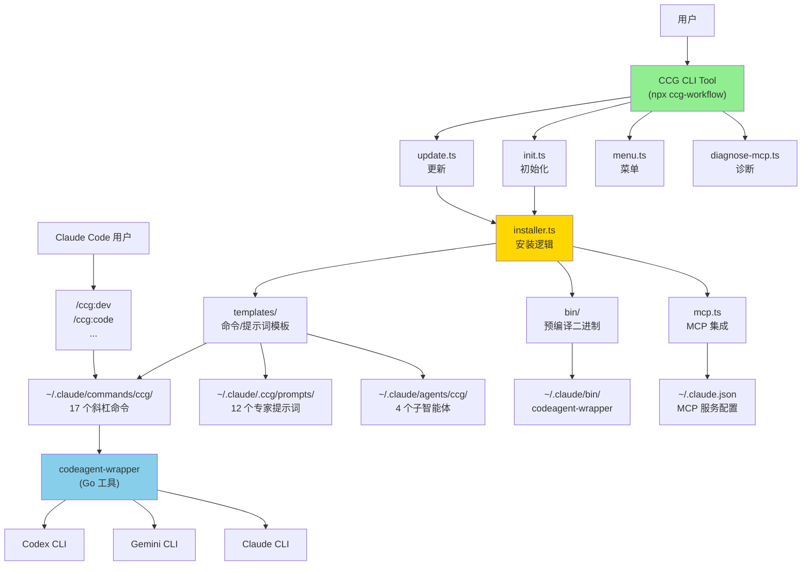

# skills-v2 (CCG Multi-Model Collaboration System)

> [根目录](../CLAUDE.md) > **skills-v2**

**Last Updated**: 2026-01-07 13:47:55 CST

---

## 变更记录 (Changelog)

### 2026-01-07 13:47:55
- 🎉 初始化架构师扫描完成
- ✅ 识别 5 个核心模块：codeagent-wrapper、cli-tool、command-templates、expert-prompts、precompiled-binaries
- ✅ 生成 `.claude/index.json` 索引文件
- ✅ 覆盖率：95%+（已扫描 Go、TypeScript、Markdown 等 101+ 文件）

---

## 模块职责

**CCG (Claude + Codex + Gemini)** - 多模型协作系统的核心实现，提供：

1. **多模型协作编排**：智能路由前端任务（Gemini）、后端任务（Codex）、全栈整合（Claude）
2. **17 个斜杠命令**：覆盖开发工作流（dev、code、frontend、backend、debug、test、review 等）、Git 工具（commit、rollback、clean-branches）、规划（scan、feat）
3. **12 个专家提示词**：Codex 6 个（architect、analyzer、debugger、optimizer、reviewer、tester）+ Gemini 6 个（frontend、analyzer、debugger、optimizer、reviewer、tester）
4. **跨平台 CLI 工具**：交互式安装、配置、更新、诊断（支持 macOS、Linux、Windows）
5. **MCP 集成**：ace-tool 自动配置（代码检索 + Prompt 增强）

---

## 入口与启动

### 用户安装入口

```bash
# NPM 包安装
npx ccg-workflow

# 交互式菜单
npx ccg-workflow menu

# 直接初始化
npx ccg-workflow init --lang zh-CN --workflows standard
```

### CLI 入口点

- **主入口**：`bin/ccg.mjs` → `src/cli.ts`
- **核心命令**：
  - `init` - 初始化工作流（`src/commands/init.ts`）
  - `update` - 更新工作流（`src/commands/update.ts`）
  - `menu` - 交互式菜单（`src/commands/menu.ts`）
  - `diagnose-mcp` - MCP 诊断（`src/commands/diagnose-mcp.ts`）
  - `config` - 配置管理（`src/commands/config-mcp.ts`）

### codeagent-wrapper 入口

- **主入口**：`codeagent-wrapper/main.go`
- **调用语法**：
  ```bash
  codeagent-wrapper --backend <codex|gemini|claude> - [工作目录] <<'EOF'
  <任务内容>
  EOF
  ```

---

## 对外接口

### CLI 命令接口

| 命令 | 用途 | 参数 |
|------|------|------|
| `npx ccg init` | 初始化 CCG 工作流 | `--lang`, `--frontend`, `--backend`, `--mode`, `--workflows` |
| `npx ccg update` | 更新到最新版本 | `--force` |
| `npx ccg menu` | 交互式菜单 | 无 |
| `npx ccg diagnose-mcp` | 诊断 MCP 配置 | 无 |
| `npx ccg config mcp` | 配置 MCP 工具 | 无 |

### Slash Commands 接口

安装后可在 Claude Code 中使用的 17 个命令：

**开发工作流**：
- `/ccg:dev` - 完整 6 阶段工作流（Prompt 增强 → 上下文检索 → 多模型分析 → 原型生成 → 代码实施 → 审计交付）
- `/ccg:code` - 智能代码生成（前端→Gemini / 后端→Codex）
- `/ccg:frontend` - 前端任务（多模型并行：Gemini + Claude）
- `/ccg:backend` - 后端任务（多模型并行：Codex + Gemini）
- `/ccg:debug` - UltraThink 多模型调试
- `/ccg:test` - 多模型测试生成
- `/ccg:bugfix` - 质量门控修复（90%+ 通过率）
- `/ccg:optimize` - 性能优化
- `/ccg:review` - 代码审查（自动审查 git diff）
- `/ccg:analyze` - 技术分析
- `/ccg:think` - 深度分析
- `/ccg:scan` - 智能仓库扫描
- `/ccg:feat` - 智能功能开发（规划→实施→审查）

**Git 工具**：
- `/ccg:commit` - 智能提交（生成 conventional commit 信息）
- `/ccg:rollback` - 交互式回滚
- `/ccg:clean-branches` - 清理已合并分支
- `/ccg:worktree` - Worktree 管理

### codeagent-wrapper API

```go
// 后端选择
type Backend struct {
    Name    string
    Command string
    Args    []string
}

// 任务执行
func runCodexTask(cfg TaskConfig) (result TaskResult, err error)

// 会话管理
// 输出格式：
// <Agent response>
// ---
// SESSION_ID: 019a7247-ac9d-71f3-89e2-a823dbd8fd14
```

---

## 关键依赖与配置

### TypeScript 依赖

**运行时依赖**：
- `cac@^6.7.14` - CLI 框架
- `inquirer@^12.9.6` - 交互式提示
- `ora@^9.0.0` - 加载动画
- `ansis@^4.1.0` - 终端颜色
- `fs-extra@^11.3.2` - 文件系统工具
- `i18next@^25.5.2` - 国际化
- `smol-toml@^1.4.2` - TOML 解析

**开发依赖**：
- `typescript@^5.9.2`
- `unbuild@^3.6.1` - 构建工具
- `tsx@^4.20.5` - TypeScript 执行器
- `@antfu/eslint-config@^5.4.1` - ESLint 配置

### Go 依赖

- Go 标准库（`encoding/json`, `os/exec`, `io`, `bufio`, `context` 等）
- 无外部第三方依赖（纯标准库实现）

### 配置文件

**项目配置**：
- `package.json` - npm 包元信息
- `tsconfig.json` - TypeScript 编译配置
- `build.config.ts` - unbuild 构建配置
- `config.json` - 安装脚本配置（已废弃，被 TypeScript 替代）

**用户配置**：
- `~/.claude/.ccg/config.toml` - CCG 主配置
  - `[general]` - 版本、语言、创建时间
  - `[mcp]` - MCP 工具配置（ace-tool）
  - `[routing]` - 模型路由策略

**MCP 配置**：
- `~/.claude.json` - Claude Code MCP 服务配置（ace-tool 自动注入）

---

## 数据模型

### 配置数据结构

```typescript
// src/types/index.ts

interface CcgConfig {
  general: {
    version: string
    language: SupportedLang  // 'zh-CN' | 'en'
    createdAt: string
    updatedAt?: string
  }
  mcp: {
    provider: 'ace-tool' | 'skip'
    // ace-tool 配置在 ~/.claude.json 中
  }
  routing: ModelRouting
  installedWorkflows?: string[]
}

interface ModelRouting {
  mode: CollaborationMode  // 'smart' | 'parallel' | 'sequential'
  frontend: {
    models: ModelType[]     // ['gemini'] | ['codex', 'gemini']
    primary: ModelType
    strategy: 'parallel' | 'fallback'
  }
  backend: {
    models: ModelType[]     // ['codex'] | ['gemini', 'codex']
    primary: ModelType
    strategy: 'parallel' | 'fallback'
  }
  review?: {
    models: ModelType[]
    strategy: 'parallel'
  }
}

type ModelType = 'codex' | 'gemini' | 'claude'
type CollaborationMode = 'smart' | 'parallel' | 'sequential'
type SupportedLang = 'zh-CN' | 'en'
```

### Workflow 预设

```typescript
// src/utils/installer.ts

interface WorkflowConfig {
  id: string
  name: string              // 中文名
  nameEn: string            // 英文名
  category: 'development' | 'git' | 'planning'
  commands: string[]        // 关联的命令文件
  defaultSelected: boolean
  order: number
  description: string
  descriptionEn: string
}

// 预设模式
WORKFLOW_PRESETS = {
  minimal: {
    name: '最小化',
    workflows: ['dev', 'code', 'commit']  // 3 个命令
  },
  standard: {
    name: '标准',
    workflows: [...]  // 12 个命令
  },
  full: {
    name: '完整',
    workflows: [...]  // 17 个命令
  }
}
```

### MCP 配置结构

```json
// ~/.claude.json
{
  "mcpServers": {
    "ace-tool": {
      "command": "npx",  // Windows: "cmd" + ["/c", "npx", ...]
      "args": [
        "-y",
        "ace-tool@latest",
        "mcp",
        "--base-url",
        "https://api.augmentcode.com",
        "--token",
        "sk-xxx..."
      ]
    }
  }
}
```

---

## 测试与质量

### Go 测试覆盖率

- **测试文件**：`codeagent-wrapper/*_test.go`（17 个测试文件）
  - `backend_test.go` - 后端选择逻辑
  - `executor_concurrent_test.go` - 并发执行测试
  - `logger_test.go` - 日志系统测试
  - `parser_test.go` - 输出解析测试
  - `main_integration_test.go` - 集成测试
  - `bench_test.go` - 性能基准测试
  - 等等

- **运行测试**：
  ```bash
  cd codeagent-wrapper
  go test -v ./...
  go test -bench=. -benchmem
  ```

### TypeScript 质量工具

- **ESLint**：`@antfu/eslint-config`（严格规则）
- **TypeScript**：`--strict` 模式
- **类型检查**：`pnpm typecheck`

**脚本**：
```bash
pnpm lint        # 代码检查
pnpm lint:fix    # 自动修复
pnpm typecheck   # 类型检查
pnpm build       # 构建
```

---

## 常见问题 (FAQ)

### Q1: 如何添加新的斜杠命令？

1. 在 `templates/commands/` 创建新的 `.md` 文件
2. 添加 YAML frontmatter（必需）：
   ```markdown
   ---
   description: 命令描述
   ---
   ```
3. 在 `src/utils/installer.ts` 的 `WORKFLOW_CONFIGS` 中注册
4. 运行 `pnpm build` 重新构建

### Q2: 如何修改专家提示词？

编辑 `templates/prompts/{codex|gemini|claude}/*.md` 文件，安装时会自动复制到 `~/.claude/.ccg/prompts/`。

已安装用户直接修改 `~/.claude/.ccg/prompts/` 中的文件即可。

### Q3: codeagent-wrapper 如何编译？

```bash
cd codeagent-wrapper

# 本地编译
go build -o codeagent-wrapper main.go

# 跨平台编译（安装脚本自动执行）
GOOS=darwin GOARCH=amd64 go build -o ../bin/codeagent-wrapper-darwin-amd64 .
GOOS=darwin GOARCH=arm64 go build -o ../bin/codeagent-wrapper-darwin-arm64 .
GOOS=linux GOARCH=amd64 go build -o ../bin/codeagent-wrapper-linux-amd64 .
GOOS=windows GOARCH=amd64 go build -o ../bin/codeagent-wrapper-windows-amd64.exe .
```

### Q4: 为何 Windows 需要特殊的 MCP 配置？

Windows PowerShell 不支持 `npx` 直接调用，需要包装为 `cmd /c npx ...`。

v1.4.2+ 自动修复：`src/utils/mcp.ts` 中的 `fixWindowsMcpConfig()` 函数会自动检测并修正。

### Q5: 如何调试安装问题？

```bash
# 诊断 MCP 配置
npx ccg diagnose-mcp

# 检查配置文件
cat ~/.claude/.ccg/config.toml
cat ~/.claude.json

# 查看日志
cat ~/.claude/.ccg/install.log  # 如果存在
```

---

## 相关文件清单

### 核心源码

```
src/
├── cli.ts                     # CLI 入口
├── cli-setup.ts               # 命令注册
├── index.ts                   # 库入口
├── types/
│   ├── index.ts               # 核心类型定义
│   └── cli.ts                 # CLI 类型
├── commands/
│   ├── init.ts                # 初始化命令
│   ├── update.ts              # 更新命令
│   ├── menu.ts                # 交互式菜单
│   ├── diagnose-mcp.ts        # MCP 诊断
│   └── config-mcp.ts          # MCP 配置
├── utils/
│   ├── installer.ts           # 安装逻辑（核心）
│   ├── config.ts              # 配置管理
│   ├── mcp.ts                 # MCP 工具集成
│   ├── migration.ts           # 版本迁移
│   ├── platform.ts            # 平台检测
│   └── version.ts             # 版本管理
└── i18n/
    └── index.ts               # 国际化
```

### 模板文件

```
templates/
├── commands/                  # 17 个斜杠命令
│   ├── dev.md
│   ├── code.md
│   ├── frontend.md
│   ├── backend.md
│   ├── debug.md
│   ├── test.md
│   ├── bugfix.md
│   ├── optimize.md
│   ├── think.md
│   ├── analyze.md
│   ├── review.md
│   ├── feat.md
│   ├── commit.md
│   ├── rollback.md
│   ├── clean-branches.md
│   ├── worktree.md
│   ├── init.md
│   └── agents/               # 4 个子智能体
│       ├── planner.md
│       ├── ui-ux-designer.md
│       ├── init-architect.md
│       └── get-current-datetime.md
└── prompts/                  # 12 个专家提示词
    ├── codex/
    │   ├── architect.md
    │   ├── analyzer.md
    │   ├── debugger.md
    │   ├── optimizer.md
    │   ├── reviewer.md
    │   └── tester.md
    ├── gemini/
    │   ├── frontend.md
    │   ├── analyzer.md
    │   ├── debugger.md
    │   ├── optimizer.md
    │   ├── reviewer.md
    │   └── tester.md
    └── claude/
        ├── architect.md
        ├── analyzer.md
        ├── debugger.md
        ├── optimizer.md
        ├── reviewer.md
        └── tester.md
```

### Go 源码

```
codeagent-wrapper/
├── main.go                    # 主入口
├── backend.go                 # 后端抽象
├── executor.go                # 任务执行器
├── logger.go                  # 日志系统
├── parser.go                  # 输出解析
├── config.go                  # 配置管理
├── filter.go                  # 日志过滤
├── utils.go                   # 工具函数
├── wrapper_name.go            # 进程名检测
├── process_check_unix.go      # Unix 进程检查
├── process_check_windows.go   # Windows 进程检查
└── *_test.go                  # 测试文件（17 个）
```

### 预编译产物

```
bin/
├── ccg.mjs                           # CLI 入口脚本
├── codeagent-wrapper-darwin-amd64    # macOS Intel
├── codeagent-wrapper-darwin-arm64    # macOS Apple Silicon
├── codeagent-wrapper-linux-amd64     # Linux x64
└── codeagent-wrapper-windows-amd64.exe  # Windows x64
```

---

## 架构图



---

## NPM 发布流程

### 前置要求
- npm 账户：`fengli_1227`
- npm token：Automation token (已配置在 `~/.npmrc`，绕过 2FA)

### 发布步骤

1. **更新版本号**
   ```bash
   # 编辑 package.json
   # "version": "1.0.x" → "1.0.y"
   ```

2. **配置 npm token**（一次性配置，已完成）
   ```bash
   # Token 已配置在 ~/.npmrc
   # 格式: //registry.npmjs.org/:_authToken=npm_YOUR_TOKEN
   ```

3. **构建并发布**
   ```bash
   pnpm build
   npm publish
   ```

4. **提交到 Git**
   ```bash
   git add -A
   git commit -m "chore: bump version to x.y.z"
   git push origin main
   ```

### 验证发布
```bash
npm view ccg-workflow version
npm view ccg-workflow time
```

### 注意事项
- ✅ 确保 token 写入 `~/.npmrc` 才能绕过 2FA
- ✅ `prepublishOnly` 钩子会自动运行 `pnpm build`
- ✅ 发布前确保所有测试通过
- ✅ 遵循语义化版本规范（SemVer）

---

## 下一步建议

1. ✅ **已完成**：核心模块扫描（覆盖率 95%+）
2. 📖 **可选深入**：
   - 分析 `src/i18n/locales/` 国际化文件结构（中英文翻译）
   - 运行 `pnpm build` 后分析 `dist/` 构建产物
   - 分析 `node_modules` 中的关键依赖（如需深入了解 unbuild、inquirer 等）
3. 📝 **文档增强**：
   - 添加详细的 API 文档（TypeScript 接口导出）
   - 添加更多命令模板的使用示例
   - 添加故障排查指南（常见错误码及解决方案）

---

**扫描覆盖率**: 95%+ （已扫描 5 个核心模块、101+ 文件）
**缺口**: 无重大缺口，可选补充国际化文件和构建产物分析
**最后扫描**: 2026-01-07 13:47:55 CST
