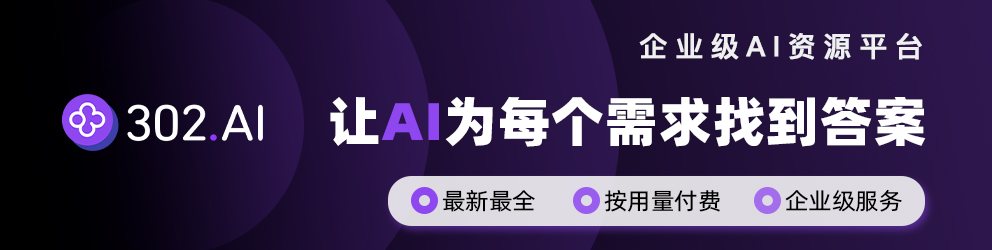

# CCG - Claude + Codex + Gemini 多模型协作

<div align="center">


[](https://www.npmjs.com/package/ccg-workflow)
[](https://opensource.org/licenses/MIT)
[](https://claude.ai/code)
[]()
[](https://x.com/CCG_Workflow)

简体中文 | [English](./README.md)

</div>

## ♥️ 赞助商

[](https://share.302.ai/oUDqQ6)

[302.AI](https://share.302.ai/oUDqQ6) 是一个按用量付费的企业级 AI 资源平台，提供市场上最新、最全面的 AI 模型和 API，以及多种开箱即用的在线 AI 应用。

---

[**n1n.ai**](https://api.n1n.ai/register?channel=c_ivgzug0w) — 企业级 LLM API 聚合平台，一个 API Key 连接全球 500+ 顶尖 AI 模型（GPT-5、Claude 4.5、Gemini 3 Pro 等）。

---

Claude Code 编排 Codex + Gemini 的多模型协作开发系统。前端任务路由至 Gemini，后端任务路由至 Codex，Claude 负责编排决策和代码审核。

## 为什么选择 CCG？

- **零配置模型路由** — 前端任务自动走 Gemini，后端任务自动走 Codex，无需手动切换。
- **安全设计** — 外部模型无写入权限，仅返回 Patch，由 Claude 审核后应用。
- **29+ 个斜杠命令** — 从规划到执行、Git 工作流到代码审查，通过 `/ccg:*` 一站式访问。
- **规范驱动开发** — 集成 [OPSX](https://github.com/fission-ai/opsx)，将模糊需求变成可验证约束，让 AI 没法自由发挥。

## 架构

```
Claude Code (编排)
       │
   ┌───┴───┐
   ↓       ↓
Codex   Gemini
(后端)   (前端)
   │       │
   └───┬───┘
       ↓
  Unified Patch
```

外部模型无写入权限，仅返回 Patch，由 Claude 审核后应用。

> **🎬 [查看 CCG 实战演示 →](https://x.com/CCG_Workflow/status/2038923720610463876)** — X 上的多模型协作真实案例

## 快速开始

### 前置条件

| 依赖 | 必需 | 说明 |
|------|------|------|
| **Node.js 20+** | 是 | `ora@9.x` 要求 Node >= 20，Node 18 会报 `SyntaxError` |
| **Claude Code CLI** | 是 | [安装方法](#安装-claude-code) |
| **jq** | 是 | 用于自动授权 Hook（[安装方法](#安装-jq)） |
| **Codex CLI** | 否 | 启用后端路由 |
| **Gemini CLI** | 否 | 启用前端路由 |

### 安装

```bash
npx ccg-workflow
```

首次运行会提示选择语言（简体中文 / English），选择后自动保存，后续无需再选。

### 安装 jq

```bash
# macOS
brew install jq

# Linux (Debian/Ubuntu)
sudo apt install jq

# Linux (RHEL/CentOS)
sudo yum install jq

# Windows
choco install jq   # 或: scoop install jq
```

### 安装 Claude Code

```bash
npx ccg-workflow menu  # 选择「安装 Claude Code」
```

支持：npm、homebrew、curl、powershell、cmd。

## 命令

### 开发工作流

| 命令 | 说明 | 模型 |
|------|------|------|
| `/ccg:workflow` | 6 阶段完整工作流 | Codex + Gemini |
| `/ccg:plan` | 多模型协作规划 (Phase 1-2) | Codex + Gemini |
| `/ccg:execute` | 多模型协作执行 (Phase 3-5) | Codex + Gemini + Claude |
| `/ccg:codex-exec` | Codex 全权执行（计划 → 代码 → 审核） | Codex + 多模型审核 |
| `/ccg:feat` | 智能功能开发 | 自动路由 |
| `/ccg:frontend` | 前端任务（快速模式） | Gemini |
| `/ccg:backend` | 后端任务（快速模式） | Codex |

### 分析与质量

| 命令 | 说明 | 模型 |
|------|------|------|
| `/ccg:analyze` | 技术分析 | Codex + Gemini |
| `/ccg:debug` | 问题诊断 + 修复 | Codex + Gemini |
| `/ccg:optimize` | 性能优化 | Codex + Gemini |
| `/ccg:test` | 测试生成 | 自动路由 |
| `/ccg:review` | 代码审查（自动 git diff） | Codex + Gemini |
| `/ccg:enhance` | Prompt 增强 | 内置 |

### OPSX 规范驱动

| 命令 | 说明 |
|------|------|
| `/ccg:spec-init` | 初始化 OPSX 环境 |
| `/ccg:spec-research` | 需求 → 约束集 |
| `/ccg:spec-plan` | 约束 → 零决策计划 |
| `/ccg:spec-impl` | 按计划执行 + 归档 |
| `/ccg:spec-review` | 双模型交叉审查 |

### Agent Teams（v1.7.60+）

| 命令 | 说明 |
|------|------|
| `/ccg:team-research` | 需求 → 约束集（并行探索） |
| `/ccg:team-plan` | 约束 → 并行实施计划 |
| `/ccg:team-exec` | spawn Builder teammates 并行写代码 |
| `/ccg:team-review` | 双模型交叉审查 |

> **前置条件**：需在 `settings.json` 中启用：`CLAUDE_CODE_EXPERIMENTAL_AGENT_TEAMS=1`

### Git 工具

| 命令 | 说明 |
|------|------|
| `/ccg:commit` | 智能提交（conventional commit 格式） |
| `/ccg:rollback` | 交互式回滚 |
| `/ccg:clean-branches` | 清理已合并分支 |
| `/ccg:worktree` | Worktree 管理 |

### 项目管理

| 命令 | 说明 |
|------|------|
| `/ccg:init` | 初始化项目 CLAUDE.md |
| `/ccg:context` | 项目上下文管理（.context 初始化/日志/压缩/历史） |

## 工作流指南

### 规划与执行分离

```bash
# 1. 生成实施计划
/ccg:plan 实现用户认证功能

# 2. 审查计划（可修改）
# 计划保存至 .claude/plan/user-auth.md

# 3a. 执行计划（Claude 重构）— 精细控制
/ccg:execute .claude/plan/user-auth.md

# 3b. 执行计划（Codex 全权）— 高效执行，Claude token 极低
/ccg:codex-exec .claude/plan/user-auth.md
```

### OPSX 规范驱动工作流

集成 [OPSX 架构](https://github.com/fission-ai/opsx)，把需求变成约束，让 AI 没法自由发挥：

```bash
/ccg:spec-init                       # 初始化 OPSX 环境
/ccg:spec-research 实现用户认证        # 研究需求 → 输出约束集
/ccg:spec-plan                       # 并行分析 → 零决策计划
/ccg:spec-impl                       # 按计划执行
/ccg:spec-review                     # 独立审查（随时可用）
```

> **提示**：`/ccg:spec-*` 命令内部调用 `/opsx:*`。每阶段之间可 `/clear`，状态存在 `openspec/` 目录，不怕上下文爆。

### Agent Teams 并行工作流

利用 Claude Code Agent Teams 实验特性，spawn 多个 Builder teammates 并行写代码：

```bash
/ccg:team-research 实现实时协作看板 API  # 1. 需求 → 约束集
# /clear
/ccg:team-plan kanban-api               # 2. 规划 → 并行计划
# /clear
/ccg:team-exec                          # 3. Builder 并行写代码
# /clear
/ccg:team-review                        # 4. 双模型交叉审查
```

> **vs 传统工作流**：Team 系列每步 `/clear` 隔离上下文，通过文件传递状态。适合可拆分为 3+ 独立模块的任务。

## 配置

### 目录结构

```
~/.claude/
├── commands/ccg/       # 29+ 个斜杠命令
├── agents/ccg/         # 子智能体
├── skills/ccg/         # 质量关卡 + 多 Agent 协同
├── bin/codeagent-wrapper
└── .ccg/
    ├── config.toml     # CCG 配置
    └── prompts/
        ├── codex/      # 6 个 Codex 专家提示词
        └── gemini/     # 7 个 Gemini 专家提示词
```

### 环境变量

在 `~/.claude/settings.json` 的 `"env"` 中配置：

| 变量 | 说明 | 默认值 | 何时修改 |
|------|------|--------|----------|
| `CODEAGENT_POST_MESSAGE_DELAY` | Codex 完成后等待时间（秒） | `5` | Codex 进程挂起时设为 `1` |
| `CODEX_TIMEOUT` | wrapper 执行超时（秒） | `7200` | 超长任务时增大 |
| `BASH_DEFAULT_TIMEOUT_MS` | Claude Code Bash 超时（毫秒） | `120000` | 命令超时时增大 |
| `BASH_MAX_TIMEOUT_MS` | Claude Code Bash 最大超时（毫秒） | `600000` | 长时间构建时增大 |

<details>
<summary>settings.json 示例</summary>

```json
{
  "env": {
    "CODEAGENT_POST_MESSAGE_DELAY": "1",
    "CODEX_TIMEOUT": "7200",
    "BASH_DEFAULT_TIMEOUT_MS": "600000",
    "BASH_MAX_TIMEOUT_MS": "3600000"
  }
}
```

</details>

### MCP 配置

```bash
npx ccg-workflow menu  # 选择「配置 MCP」
```

**代码检索**（多选一）：
- **ace-tool**（推荐）— 代码检索 `search_context` 可用。[官方](https://augmentcode.com/) | [第三方中转](https://acemcp.heroman.wtf/)
- **fast-context**（推荐）— Windsurf Fast Context，AI 驱动搜索，无需全量索引。需 Windsurf 账号
- **ContextWeaver**（备选）— 本地混合搜索，需要硅基流动 API Key（免费）

**辅助工具**（可选）：
- **Context7** — 获取最新库文档（自动安装）
- **Playwright** — 浏览器自动化 / 测试
- **DeepWiki** — 知识库查询
- **Exa** — 搜索引擎（需 API Key）

### 自动授权 Hook

CCG 安装时自动写入 Hook，自动授权 `codeagent-wrapper` 命令（需 [jq](#安装-jq)）。

<details>
<summary>手动配置（v1.7.71 之前的版本）</summary>

在 `~/.claude/settings.json` 中添加：

```json
{
  "hooks": {
    "PreToolUse": [
      {
        "matcher": "Bash",
        "hooks": [
          {
            "type": "command",
            "command": "jq -r '.tool_input.command' 2>/dev/null | grep -q 'codeagent-wrapper' && echo '{\"hookSpecificOutput\": {\"hookEventName\": \"PreToolUse\", \"permissionDecision\": \"allow\", \"permissionDecisionReason\": \"codeagent-wrapper auto-approved\"}}' || true",
            "timeout": 1
          }
        ]
      }
    ]
  }
}
```

</details>

## 实用工具

```bash
npx ccg-workflow menu  # 选择「实用工具」
```

- **ccusage** — Claude Code 用量分析
- **CCometixLine** — 状态栏工具（Git + 用量跟踪）

## 更新 / 卸载

```bash
# 更新
npx ccg-workflow@latest            # npx 用户
npm install -g ccg-workflow@latest  # npm 全局用户

# 卸载
npx ccg-workflow  # 选择「卸载工作流」
npm uninstall -g ccg-workflow  # npm 全局用户需额外执行
```

## 常见问题

### Codex CLI 0.80.0 进程不退出

`--json` 模式下 Codex 完成输出后进程不会自动退出。

**解决**：将 `CODEAGENT_POST_MESSAGE_DELAY` 设为 `1`，详见[环境变量](#环境变量)。

## 参与贡献

欢迎贡献！请阅读 [CONTRIBUTING.md](./CONTRIBUTING.md) 了解开发指南。

想找一个入手点？查看标记为 [`good first issue`](https://github.com/fengshao1227/ccg-workflow/labels/good%20first%20issue) 的 Issue。

## 贡献者

<!-- readme: contributors -start -->
<table>
<tr>
    <td align="center"><a href="https://github.com/fengshao1227"><br /><sub><b>fengshao1227</b></sub></a></td>
    <td align="center"><a href="https://github.com/SXP-Simon"><br /><sub><b>SXP-Simon</b></sub></a></td>
    <td align="center"><a href="https://github.com/RebornQ"><br /><sub><b>RebornQ</b></sub></a></td>
    <td align="center"><a href="https://github.com/Sakuranda"><br /><sub><b>Sakuranda</b></sub></a></td>
    <td align="center"><a href="https://github.com/Mriris"><br /><sub><b>Mriris</b></sub></a></td>
    <td align="center"><a href="https://github.com/23q3"><br /><sub><b>23q3</b></sub></a></td>
    <td align="center"><a href="https://github.com/MrNine-666"><br /><sub><b>MrNine-666</b></sub></a></td>
</tr>
<tr>
    <td align="center"><a href="https://github.com/GGzili"><br /><sub><b>GGzili</b></sub></a></td>
</tr>
</table>
<!-- readme: contributors -end -->

## 致谢

- [cexll/myclaude](https://github.com/cexll/myclaude) — codeagent-wrapper
- [UfoMiao/zcf](https://github.com/UfoMiao/zcf) — Git 工具
- [GudaStudio/skills](https://github.com/GuDaStudio/skills) — 路由设计
- [ace-tool](https://linux.do/t/topic/1344562) — MCP 工具

## Star History

[](https://www.star-history.com/#fengshao1227/ccg-workflow&type=timeline&legend=top-left)

## 联系方式

- **X (Twitter)**: [@CCG_Workflow](https://x.com/CCG_Workflow) — 更新动态、实战演示、使用技巧
- **邮箱**: [fengshao1227@gmail.com](mailto:fengshao1227@gmail.com) — 赞助、合作洽谈、开发交流
- **Issues**: [GitHub Issues](https://github.com/fengshao1227/ccg-workflow/issues) — Bug 反馈与功能建议
- **讨论区**: [GitHub Discussions](https://github.com/fengshao1227/ccg-workflow/discussions) — 问题咨询与社区交流

## License

MIT

---

v2.1.16 | [Issues](https://github.com/fengshao1227/ccg-workflow/issues) | [参与贡献](./CONTRIBUTING.md)
